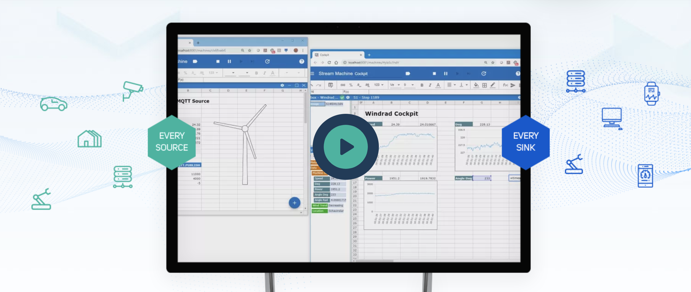

<h1 align="center">Welcome to the Streamsheet® core project</h1>

<div align="center">
	<!-- <a href="https://travis-ci.com/cedalo/streamsheets"
		></a> -->
	<a href="https://github.com/cedalo/streamsheets">
		
	</a>
	<a href="https://github.com/cedalo/streamsheets/graphs/commit-activity">
		
	</a>
	<br/>
	<a href="https://docs.cedalo.com/installation.html">
		
	</a>
	
	
	<br/>
	<a href="https://forum.cedalo.com">
		
	</a>
	<a href="https://forum.cedalo.com">
		
	</a>
	<a href="https://forum.cedalo.com">
		
	</a>
	<!-- <a href="https://forum.cedalo.com">
		
	</a> -->
	<a href="https://twitter.com/cedalo_com">
		
	</a>
</div>

<br/>

The Streamsheet® core is an open-source tool for making your data immediately understandable and for creating IoT applications visually and interactively - without a single line of code.

<p align="center">
  
</p>

If you are new to Streamsheets, you should start with the [introduction guide](https://docs.cedalo.com/introduction.html) or with the following video:

<p align="center">
  <a href="https://www.youtube.com/watch?v=fNJcIVSneH4
" target="_blank"></a>
</p>

Also, visit us on our [website](https://cedalo.com/) or check out the [Streamsheets forum](https://forum.cedalo.com/).

## Table of contents

-   [Quick start](#quick-start)
-   [Documentation](#documentation)
-   [FAQ](#faq)
-   [License](#license)

## 🚀 Quick start

The easiest way to install Streamsheets is to use the [official installer](https://docs.cedalo.com/streamsheets/installation/). After successfully running the installer navigate to the install directory and run the start script (depending on the target platform).

For Linux:
```
cd <PATH>
sh start.sh
```

For macOS:
```
cd <PATH>
sh start.sh
```

For Windows:
```
cd <PATH>
start.bat
```

For Raspberry Pi:
```
cd <PATH>
sh start.sh
```

## 📚 Documentation

You can find the Streamsheet documentation on the [documentation website](https://docs.cedalo.com/).

Check out the Getting Started page for a quick overview.

The documentation is divided into several sections:

* [Installation](https://docs.cedalo.com/streamsheets/installation)
* [Introduction](https://docs.cedalo.com/streamsheets/introduction)
* [Main Components](https://docs.cedalo.com/streamsheets/maincomponents)
* [Getting Started](https://docs.cedalo.com/streamsheets/getting-started)
* [Tutorials](https://docs.cedalo.com/streamsheets/tutorials/tut-general/)
* [Glossary](https://docs.cedalo.com/streamsheets/glossary)

## 🙋 FAQ

### Who maintains Streamsheets?

Streamsheets are maintained by the [Cedalo AG](https://cedalo.com/).

### Looking for a hosted version of Streamsheets?

If you are interested in a hosted version of Streamsheets on our infrastructure please [contact us](https://cedalo.com/contact-us/)

### Looking for support?

For questions and support please join our [Forum](https://forum.cedalo.com), ask a question on [Stack Overflow](https://stackoverflow.com/questions/tagged/streamsheets), or contact us on [Twitter](https://twitter.com/cedalo_com).

### Where are the docs?

Check out our documentation website: [docs.cedalo.com](https://docs.cedalo.com/).

### Want to contribute to Streamsheets?

Check out our [CONTRIBUTING.md](CONTRIBUTING.md) to get started.

- Check out the issues with the [good first issue](https://github.com/cedalo/streamsheets/labels/good%20first%20issue) and [help wanted](https://github.com/cedalo/streamsheets/labels/help%20wanted) label.
- Also have a look at our [roadmap](notes/roadmap).

### How is the repository structured?

The Streamsheets repository is organized as a mono repository that is composed of many npm packages.

## ⭐️ Show your support

Give a ⭐️ if this project helped you!

## 📃 License

Copyright (c) 2017-2021 Cedalo AG.

Streamsheets is licensed under the Eclipse Public License - v 2.0. Please see the LICENSE file for details.
